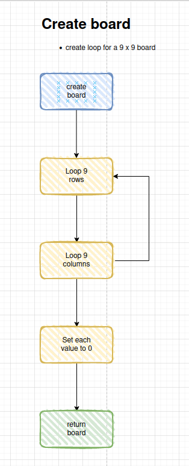
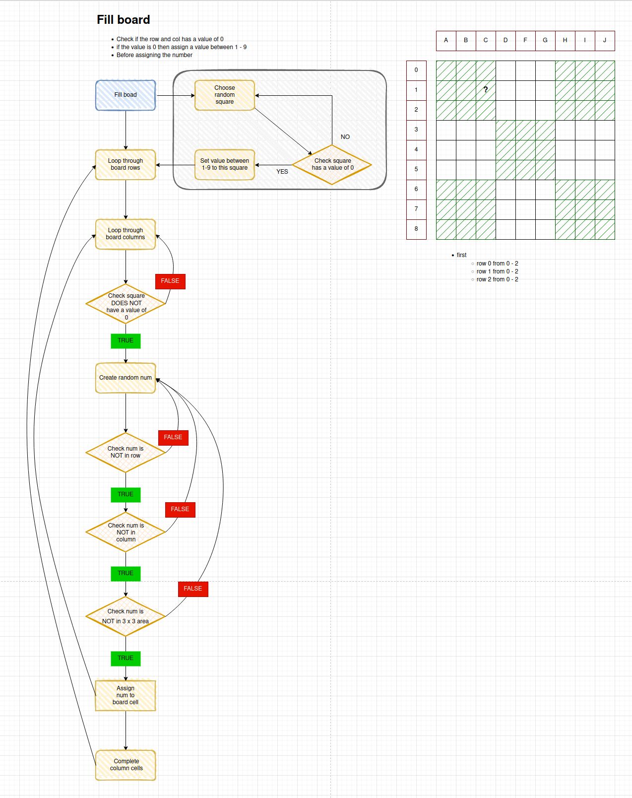
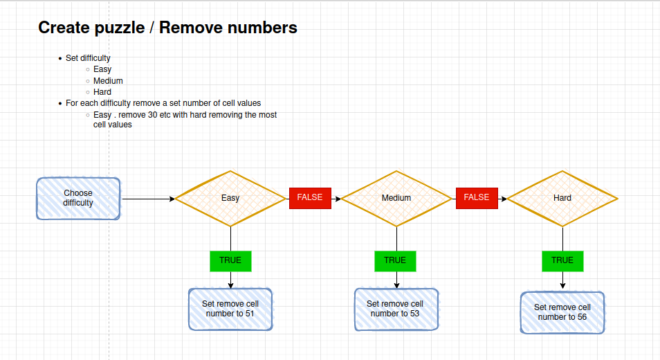

# Sudoku

[//]: # (TODO Add screen shot of app)

[Here is the live version of my project](https://sudoku-creator-solver.herokuapp.com/)

The application is based on a [Guardian newspaper Sudoku puzzle](https://www.theguardian.com/lifeandstyle/series/sudoku). The difficulty range was inspired by the online version. 

My partner's mother, Andrea Tschudi, really enjoys puzzles such as [Doplo](https://sumaddle.com/fundamentals.html) (also known as Smashed Sums) and Sudoku. As I am more familiar to Sudoku, I thought I would create an application with Andrea Tschudi in mind. 

## Table of contents
* [How to Play](#how-to-play)

* [User Experience](#user-experience--ux-)
  * [Intended Audience](#intended-audience)
  * [User Stories](#user-stories)

* [Design](#design)
  * [Flowchart](#flowchart)
  * [Data Model](#data-model)

* [Features](#features)
  * [General Features on Each Page](#general-features-on-each-page)
  * [Future Implementations](#future-implementations)
  * [Accessibility](#accessibility)

* [Technologies Used](#technologies-used)
  * [Languages Used](#languages-used)
  * [Frameworks, Libraries & Programs Used](#frameworks-libraries--programs-used)

* [Remote & Local Development](#remote--local-development)
  * [Remote Deployment](#remote-deployment)
  * [Local Deployment](#local-deployment)
    * [How to Fork](#how-to-fork)
    * [How to Clone](#how-to-clone)

* [Testing](#testing)
  * [Bugs](#bugs)
  * [Remaining Bugs](#remaining-bugs)
  * [Validator Testing](#validator-testing)

* [Credits](#credits)
  * [Code Used](#code-used)
  * [Content](#content)
  * [Media](#media)
  * [Acknowledgments](#acknowledgments)

---

# How to Play
- A Sudoku puzzle is created with a 9 by 9 square (9 rows and 9 columns).
- The 9 by 9 square is also divided into 3 by 3 areas (a total of 9 x 3 by 3 areas).
- Each row, column and 3 by 3 area must contain numbers 1 - 9 (inclusive).
- Numbers cannot be repeated in the row, column nor 3 by 3 area

# User Experience (UX)

* ## Intended Audience
  * Adults 
  * Children 

* ## User stories
  * ### Client Goals
    * list of client goals
  * ## First Time Visitor Goals
    * list of first time visitor goals
  * ## Return Visitor Goals
    * list of return visitor goals
  * ## Frequent Visitor Goals
    * list of frequent visitor goals

# Design

## Flowchart
### Creating the game

Create board

 

*Flowchart - using recursion to crete a 9 x 9 grid*

 

Fill board

 

*Flowchart - using recursion to fill board with numbers 1 - 9*

 

Remove numbers from completed board, dependent on difficulty

 

*Flowchart - using recursion remove a set number of numbers from board*

 

## Data Model

# Features

## General Features on Each Page

## Future Implementations

## Accessibility

# Technologies Used

## Languages Used
- Python
- HTML5
- CSS3

## Frameworks, Libraries & Programs Used
- Git
- GitHub
- PyCharm
  - including debugging tools

# Remote & Local Development

## Remote Deployment

## Local Deployment

### How to Fork

### How to Clone

# Testing

## Bugs
| Bug / Errors | Where / Location | Device | Remarks | Fixed | Solution |
|--------------|------------------|--------|---------|:-----:|----------|

## Remaining Bugs
| Bug / Errors | Where / Location | Device | Remarks | Fixed | Solution |
|--------------|------------------|--------|---------|:-----:|----------|

## Validator Testing
| Bug / Errors | Where / Location | Device | Remarks | Fixed | Solution |
|--------------|------------------|--------|---------|:-----:|----------|

# Credits
## Code Used
References and guides used

* [12 Beginner Python Projects](https://www.youtube.com/watch?v=8ext9G7xspg&t=6715s)
* [How to print bold text in Python, in Stackoverflow](https://stackoverflow.com/a/20210807/8614652)
* [Create ASCII Art Text Banners in Python](https://www.devdungeon.com/content/create-ascii-art-text-banners-python)
* Python libraries
  * Built in:
    * [enum](https://docs.python.org/3/library/enum.html)
    * [copy](https://docs.python.org/3/library/copy.html)
    * [pprint](https://docs.python.org/3/library/pprint.html)
    * [random](https://docs.python.org/3/library/random.html)
  * Installed:
    * [termcolor](https://pypi.org/project/termcolor/)
    * [pyfiglet](https://github.com/pwaller/pyfiglet/tree/master)
      * Additional references:
        - [Checking fonts tool](https://patorjk.com/software/taag/#p=display&f=Graffiti&t=Type%20Something%20)
        - [Prettify your Terminal Text with Termcolor and Pyfiglet](https://towardsdatascience.com/prettify-your-terminal-text-with-termcolor-and-pyfiglet-880de83fda6b)
        - [Fonts overview](http://www.jave.de/figlet/fonts/overview.html)
* [ANSI Escape Sequences](https://gist.github.com/fnky/458719343aabd01cfb17a3a4f7296797?permalink_comment_id=3857871)
* [ReeEx Testing](https://www.regextester.com/)
* [Alphabet range in Python](https://stackoverflow.com/questions/16060899/alphabet-range-in-python)
* [How to print Sudoku board using Python class?](https://stackoverflow.com/questions/72159405/how-to-print-sudoku-board-using-python-class)

## Content

All text content and prompts created was kept short and direct. Ensuring the characters would not wrap. 
Puzzle difficulty was inspired by the [Sudoku puzzles printed in the Guardian newspaper](https://www.theguardian.com/lifeandstyle/series/sudoku)

## Media

## Acknowledgments